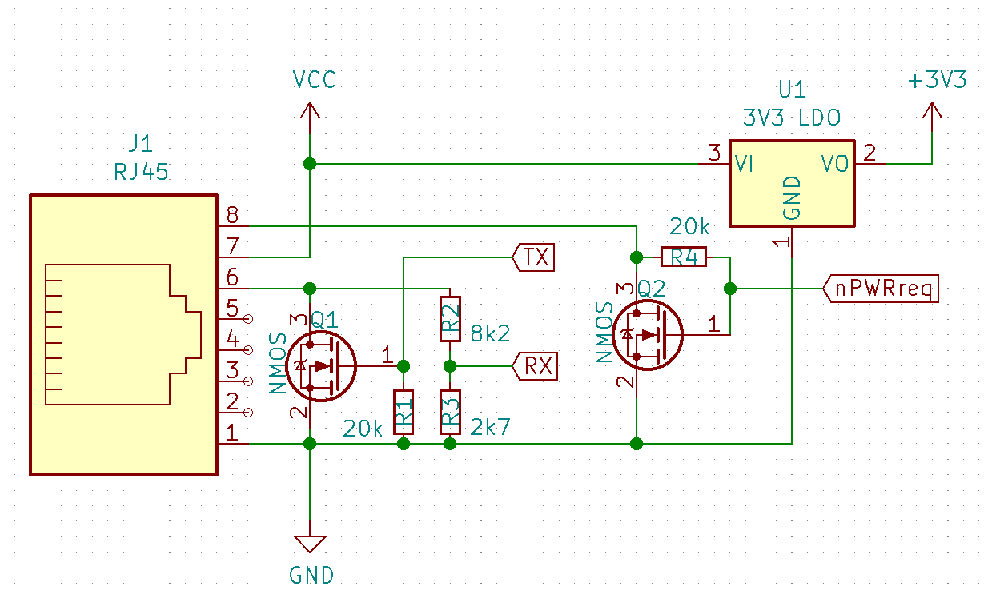

# ESP32 LINAK Desk Controller

This project uses an ESP32 to read and write data to the control box found in many LINAK standing desks.

For now, the following is implemented:
- Reading the current height of desk.
- Setting the current height to a specific value.
- Exposing the above to an MQTT broker.

## Hardware

In order to interface with the desk, a custom circuit is needed. LINAK uses LIN Bus to communicate over the RJ45 port on the desk which operates at 12V and uses a single wire for RX and TX. We need to bring this down to ~3.3V and add a transistor to bring it down to GND when doing TX.

Full credit for the schematic goes to [github.com/stevew817/linak_desk](https://github.com/stevew817/linak_desk).



I use a 2N2222 transistor for Q1. The exact resistors used don't matter much, as long as the resulting voltage divider brings the 12V down to ~3V.

Wire up RX and TX to the pins defined in `RX_PIN` and `TX_PIN` in the code.

## ESP-IDF Configuration

Using menuconfig, update the variables within `User Configuration` to match your preferences.

## Home Assistant Integration

By default, this project exposes two topics to MQTT that can easily be integrated into Home Assistant: `height` and `setheight`.

Adding them to Home Assistant can be as simple as adding the following to your `configuration.yaml`:

```
mqtt:
  - number:
      name: "Set Desk Height"
      command_topic: desk/setheight
      min: 0
      max: 4900
  - sensor:
      name: "Desk Height"
      state_topic: "desk/height"
```

For controlling the desk from the Home Assistant UI, I have created a custom Tile feature in [number-desk-tile-feature.js](number-desk-tile-feature.js) that can be added like any other custom card:


The sit and stand heights can be configured through the UI.

## Current issues

For the most part, everything works as you would expect, but there are a few small issues that need to be fixed / implemented:
- Occasionally the desk will stop mid-movement, but will resume quickly.
    - This is most likely due to a brief failure in replying with the PBRS sequence. Needs to be looked into.
- When first started, the desk won't respond to commands until the physical switch is pressed.
    - This is most likely because the desk controller sleeps until woken up, which can only be done with a physical switch or by implementing HB04.
    - After it has been woken up however, it will stay on while the ESP32 is running.

# References
- [github.com/stevew817/linak_desk](https://github.com/stevew817/linak_desk): The general approach to reading the LIN Bus frames and the schematic have been borrowed from here.